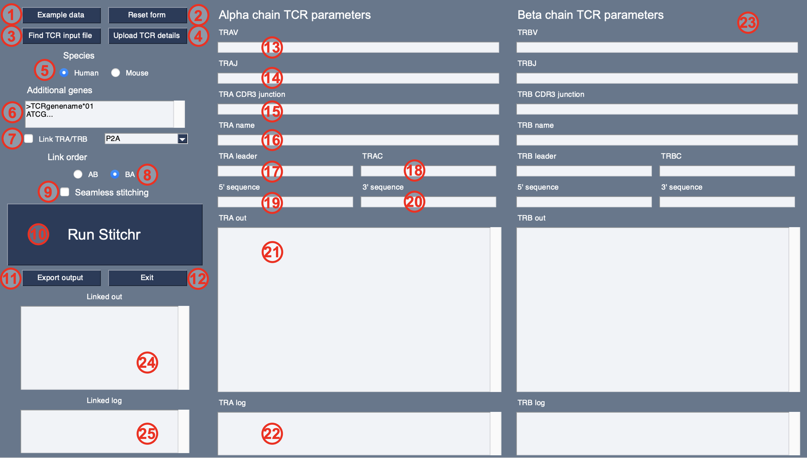

# 1.0.1

### Stitch together TCR coding nucleotide sequences from V/J/CDR3 information

##### Jamie Heather | CCR @ MGH | 2022

### Summary

Sometimes you need a complete TCR nucleotide or amino acid sequence, but all you have is limited information. This script aims to generate a coding nucleotide sequence for a given rearrangement (e.g. for use when generating TCR expression vectors) in those situations.

The script takes the known V/J/CDR3 information, and uses that to pull out the relevant germline TCR nucleotide sequences and stitch them together. Its modular approach can be used for the automated generation of TCR sequences for gene synthesis and functional testing, or for TCR engineering through supplying modified germline sequences.

Out of the box, `stitchr` works on all common jawed vertebrate TCR loci (alpha/beta/gamma/delta), for all species for which there is currently data available in IMGT.

### Citing `stitchr`

The manuscript describing and validating `stitchr` is available here:

[James M Heather, Matthew J Spindler, Marta Herrero Alonso, Yifang Ivana Shui, David G Millar, David S Johnson, Mark Cobbold, Aaron N Hata, `Stitchr`: stitching coding TCR nucleotide sequences from V/J/CDR3 information, *Nucleic Acids Research*, **2022**;, gkac190, https://doi.org/10.1093/nar/gkac190](https://doi.org/10.1093/nar/gkac190).

The corresponding analyses and related datasets are available [here](https://github.com/JamieHeather/stitchr-paper-analysis) (which used v1.0.0 `stitchr` scripts). 

### Installation and dependencies

`Stitchr` is designed to be run on Python 3, and has primarily been tested on Python 3.7.7 and 3.8.3. 

Simply clone the repo to a desired location, navigate to the Scripts directory, then you can run the script via the command line as detailed below.

The only non-standard Python module used is `PySimpleGUI`, which is only required for users that wish to use the [**graphical user interface version (`gui-stitchr`)**](#gui-stitchr). This can be installed via `pip`, e.g.:

```bash
pip3 install PySimpleGUI
```

## Example usage 

`Stitchr` uses relative paths. Please ensure you are in the Scripts directory to run the script. The only required fields are the minimal components describing a single rearranged TCR chain: V gene name, J gene name, and CDR3 sequence (either DNA or amino acids). Constant regions must also be specified for all non-human/non-mouse species.

```bash
python3 stitchr.py -v [IMGT V gene] -j [IMGT J gene] -cdr3 [CDR3aa]

python3 stitchr.py -v TRBV7-3*01 -j TRBJ1-1*01 -cdr3 CASSYLQAQYTEAFF

python3 stitchr.py -v TRAV1-2 -j TRAJ33 -cdr3 TGTGCTGTGCTGGATAGCAACTATCAGTTAATCTGG
```

### Usage notes

This script can take either amino acid or nucleotide sequences for the CDR3 junction. However when submitting an amino acid CDR3 sequence, `stitchr` will in most cases **not** produce the actual recombined sequences that encoded the original TCRs, apart from a few edge cases (such as particularly germ-like like alpha chain rearrangements). In these cases, `stitchr` recreates an equivalent full length DNA sequence that will encode the same protein sequence. It aims to produce a sequence as close to germline as possible, so all CDR3 residues that *can* be germline encoded by the V and J genes are. Non-templated residues in the CDR3 (or those templated by the D gene, which is treated as non-templated for the purpose of stitching) are chosen from taking the most commonly used codon per residue.

When provided with a nucleotide CDR3 sequence `stitchr` can simply line up the edges of the V and the J and pop it in. (The exception that might still produce slightly different nucleotide sequences is when during non-templated deletion and addition a long stretch of V or J gene nucleotides were removed and then a different sequence coincidentally encoding the same amino acids was introduced.)

Care must be taken to ensure that the correct TCR informaton is input. E.g. ensure that:
* You're using proper IMGT gene nomenclature
    * Older/deprecated gene names will not work
* You have the correct and full [CDR3 **junction** sequence](http://www.imgt.org/FAQ/#question39), either as amino acid or DNA sequences 
    * I.e. running inclusively from the conserved cysteine to the conserved phenylalanine (or rarely, tryptophan) residues
* You are using the right alleles for the TCR genes in question if known (i.e. the bit after the asterisk in the gene name)
    * There are many known non-synonymous polymorphisms (and undoubtedly many more unknown ones) which could be impacting on antigen recognition, surface expression, and other aspects of TCR biology
* For best results, try to get long read TCR sequence data and process it through V/J/CDR3 annotation software which is capable of a) providing allele-level resolution, and b) can take up-to-date germline reference files.

The script produces a TCR from the information given, trying to provide warnings or errors if it detects an improbable or implausible combination, yet it's possible that the script might produce output that *looks* OK yet which does not reproduce a coding sequence for the intended TCR. 

If you request an allele for which there isn't complete sequence data, the script will attempt to default to the prototypical allele (*01) of that gene, or a preferred default allele if the `-p` flag is set (see below). If it cannot find sequence for that then it will throw an error. Similarly it will attempt to use the correct leader seqeunces (L-PART1+L-PART2) for the specified allele, but if it can't find one it'll default back to the prototype's. Note that IMGT-provided gene sequences which are 'partial' at either end of their sequence are discounted entirely, as full length sequences are needed. If the script is needed to stitch TCRs that make use of genes that are partial at their recombination-distal ends then you can modify the FASTA header for these entries in the Data directory. 

For human and mouse TCRs, the script will use the TRBC gene located in the same cluster as the J gene (i.e. TRBJ1-1 through TRBJ1-6 will get TRBC1, while TRBJ2-1 through TRBJ2-7 will get TRBC2). This can be overriden (see optional arguments). Unfortunately we are not experts in TCR loci architecture of all species, so we haven't hard-wired any other constant region assumptions, so for all other species you'll need to explicitly state which constant region you want used.

By default `stitchr` does not include stop codons at the end of the coding sequence; if desired, this must be specified using the 3' flag (`-3p`), i.e. `-3p TAA`, `-3p TAG`, or `-3p TGA`. Similarly, no sequence is included before that of the IMGT-recorded L1 leader sequence. If desired, this can be added using the 5' flag (`-5p`), e.g. to add the pre-start codon section of an optimal Kozak sequence: `-5p GCCGCCACC`.  Note that translated sequence in the output is the *whole* stitched sequence, including any added 5'/3' sequences: addition of 5' sequences may cause the introduction of underscores ('_') to appear in the translated output, representing incomplete codons that could not be translated. Also note that the translated sequence of an individual chain may differ from the corresponding section of a linked heterodimer for this reason, depending on the length/frame of the 5' rearrangement.

`Stitchr` can be run in a higher-throughput mode, using a tab-separated input file - see the instructions for [**`thimble`**](#Thimble) below.

#### Seamless mode

If users care about accurately replicating the exact nucleotide sequence of specific V(D)J rearrangements, and they have additional nucleotide sequences beyond the edges of the CDR3 junction, they can make use of the optional `-sl` 'seamless' flag to stitch together the complete recombined sequence as faithfully as possible.

E.g. instead of these first two options:
```bash
python3 stitchr.py -v TRBV7-6 -j TRBJ1-4 -cdr3 CASSSGQGLGEKLFF
python3 stitchr.py -v TRBV7-6 -j TRBJ1-4 -cdr3 TGTGCCAGCAGTTCCGGACAGGGCTTGGGAGAAAAACTGTTTTTT
```

... you would run (NB non-CDR3 nucleotides shown in lower case for display purposes):
```bash
python3 stitchr.py -sl -v TRBV7-6 -j TRBJ1-4 -cdr3 catgtatcgcTGTGCCAGCAGTTCCGGACAGGGCTTGGGAGAAAAACTGTTTTTTggcagtggaa
```

In this example aligning the results shows that the second serine in the CDR3 was actually encoded by 'AGT' in the rearrangement: the 'AGC' codon present in the germline gene must have been deleted and this alternative 'S' codon added or completed by Tdt. Thus while all options should produce the same amino acid sequence, the seamless option allows for truer generation of the sequence as was present in the clonotype. Note that the seamless option adds significantly to the time it takes to run `stitchr` (which only really matters when running it on high-throughput datasets using `thimble`).

In order to best use the seamless option, please ensure that:
* You have sufficient nucleotide context on either side of the CDR3 (especially the V) - ideally 20-30 nucleotides.
* Do not include any leader or constant region nucleotides - this may involve trimming nucleotide sequences.
* Ensure your V gene and allele calling is accurate, or at the very least that the contextual sequence lacks polymorphisms or errors in its very 5'. 
  * `stitchr` will attempt to detect and deal with single nucleotide mismatches with the stated allele, but more complex polymorphisms will result in a failure.
  
### Other optional arguments

* `-h` - see a help menu, containing all the command line options
* `-c` - specify a particular constant region gene (in the case of TRBC) or allele
* `-s` - specify a species: 'HUMAN' is the default (see table below)
* or 'mouse' are the only valid options currently, with human as default 
* `-aa` - provide an incomplete amino acid sequence (spanning at least the CDR3, with some padding on either side), to assess the accuracy of the stitched TCR sequence. Must be a single string, unbroken by spaces or linebreaks
* `-cu` - specify the path to an alternative codon usage file, from which to generate the sequences for the non-templated residues (see below)
* `-p` - specify a path containing gene allele preferences (see below) 
* `-l` - use a different leader region to that present with the given V  
* `-n` - provide a name for the TCR chain, which will be included in the FASTA file header
* `-3p` - provide a sequence to come immediately after the end of the constant region (e.g. a stop codon)
* `-5p` - provide a sequence to come immediately before the start of the L1 leader sequence (e.g. a Kozak sequence)
* `-m` - define an output mode, to define which sequences get printed to the terminal 
* `-xg` - toggle providing additional/custom genes to be stitched into TCR transcripts in the Data/additional-genes.fasta file
* `-sc` - toggle skipping the constant region gene check (for genes not present in the C-region-motifs.tsv file)

#### Output modes

`Stitchr` can output the TCR sequences it generates in a number of different formats, which [may help integrate its output into certain pipelines](https://github.com/JamieHeather/stitchr/issues/22). These modes can be specified using the `-m / --mode` flag, using one of the following options:

* `-m BOTH_FA`
  * Default option
  * Outputs a horizontal line, followed by the full, formatted, descriptive FASTA sequence of the stitched TCR, both nucleotide and translated amino acid sequence
* `-m NT_FA`
  * Outputs a horizontal line and the FASTA nucleotide sequence of the stitched TCR
* `-m AA_FA`
  * Outputs a horizontal line and the FASTA translated amino acid sequence of the stitched TCR 
* `-m NT`
  * Outputs just the nucleotide sequence of the stitched TCR (no lines, no linebreaks, no FASTA header)
* `-m AA`
  * Outputs just the translated amino acid sequence of the stitched TCR (no lines, no linebreaks, no FASTA header)

#### Providing a partial amino acid sequence

If you provide a partial amino acid sequence using the `-aa` flag, `stitchr` will perform a rudimentary pairwise alignment, just to give a quick visual assessment of the quality of the sequence generation.

#### A fancier example

Let's take the example of the well described A2-NLV restricted [C25 TCR from the 5D2N PDB structure](https://www.rcsb.org/structure/5d2n). We can take the amino acid sequence straight from the PDB FASTA file:

```
>5D2N:E|PDBID|CHAIN|SEQUENCE
MGAGVSQSPRYKVTKRGQDVALRCDPISGHVSLYWYRQALGQGPEFLTYFNYEAQQDKSGLPNDRFSAERPEGSISTLTI
QRTEQRDSAMYRCASSLAPGTTNEKLFFGSGTQLSVLEDLNKVFPPEVAVFEPSEAEISHTQKATLVCLATGFYPDHVEL
SWWVNGKEVHSGVCTDPQPLKEQPALNDSRYALSSRLRVSATFWQNPRNHFRCQVQFYGLSENDEWTQDRAKPVTQIVSA
EAWGRAD
```

We can then pull out the V, J, and CDR3 information. There's lots of ways to do this, but the easiest manual way is to find the CDR3 and then search the immediately neighbouring sequences against V/J amino acid sequences (obtainable via IMGT/GENE-DB). This gives:
  
TRBV7-6 / TRBJ1-4 / CASSLAPGTTNEKLFF

Then we can run the code like this:

```bash
python3 stitchr.py -v TRBV7-6 -j TRBJ1-4 -cdr3 CASSLAPGTTNEKLFF -n C25 -aa MGAGVSQSPRYKVTKRGQDVALRCDPISGHVSLYWYRQALGQGPEFLTYFNYEAQQDKSGLPNDRFSAERPEGSISTLTIQRTEQRDSAMYRCASSLAPGTTNEKLFFGSGTQLSVLEDLNKVFPPEVAVFEPSEAEISHTQKATLVCLATGFYPDHVELSWWVNGKEVHSGVCTDPQPLKEQPALNDSRYALSSRLRVSATFWQNPRNHFRCQVQFYGLSENDEWTQDRAKPVTQIVSAEAWGRAD

# Produces the following output

>nt-C25-TRBV7-6*01-TRBJ1-4*01-TRBC1*01-CASSLAPGTTNEKLFF-leader-TRBV7-6*01
ATGGGCACCAGTCTCCTATGCTGGGTGGTCCTGGGTTTCCTAGGGACAGATCACACAGGTGCTGGAGTCTCCCAGTCTCCCAGGTACAAAGTCACAAAGAGGGGACAGGATGTAGCTCTCAGGTGTGATCCAATTTCGGGTCATGTATCCCTTTATTGGTACCGACAGGCCCTGGGGCAGGGCCCAGAGTTTCTGACTTACTTCAATTATGAAGCCCAACAAGACAAATCAGGGCTGCCCAATGATCGGTTCTCTGCAGAGAGGCCTGAGGGATCCATCTCCACTCTGACGATCCAGCGCACAGAGCAGCGGGACTCGGCCATGTATCGCTGTGCCAGCAGCCTGGCCCCCGGCACCACTAATGAAAAACTGTTTTTTGGCAGTGGAACCCAGCTCTCTGTCTTGGAGGACCTGAACAAGGTGTTCCCACCCGAGGTCGCTGTGTTTGAGCCATCAGAAGCAGAGATCTCCCACACCCAAAAGGCCACACTGGTGTGCCTGGCCACAGGCTTCTTCCCCGACCACGTGGAGCTGAGCTGGTGGGTGAATGGGAAGGAGGTGCACAGTGGGGTCAGCACGGACCCGCAGCCCCTCAAGGAGCAGCCCGCCCTCAATGACTCCAGATACTGCCTGAGCAGCCGCCTGAGGGTCTCGGCCACCTTCTGGCAGAACCCCCGCAACCACTTCCGCTGTCAAGTCCAGTTCTACGGGCTCTCGGAGAATGACGAGTGGACCCAGGATAGGGCCAAACCCGTCACCCAGATCGTCAGCGCCGAGGCCTGGGGTAGAGCAGACTGTGGCTTTACCTCGGTGTCCTACCAGCAAGGGGTCCTGTCTGCCACCATCCTCTATGAGATCCTGCTAGGGAAGGCCACCCTGTATGCTGTGCTGGTCAGCGCCCTTGTGTTGATGGCCATGGTCAAGAGAAAGGATTTC

>aa-C25-TRBV7-6*01-TRBJ1-4*01-TRBC1*01-CASSLAPGTTNEKLFF-leader-TRBV7-6*01
MGTSLLCWVVLGFLGTDHTGAGVSQSPRYKVTKRGQDVALRCDPISGHVSLYWYRQALGQGPEFLTYFNYEAQQDKSGLPNDRFSAERPEGSISTLTIQRTEQRDSAMYRCASSLAPGTTNEKLFFGSGTQLSVLEDLNKVFPPEVAVFEPSEAEISHTQKATLVCLATGFFPDHVELSWWVNGKEVHSGVSTDPQPLKEQPALNDSRYCLSSRLRVSATFWQNPRNHFRCQVQFYGLSENDEWTQDRAKPVTQIVSAEAWGRADCGFTSVSYQQGVLSATILYEILLGKATLYAVLVSALVLMAMVKRKDF

MG------------------AGVSQSPRYKVTKRGQDVALRCDPISGHVSLYWYRQALGQ
||                  ||||||||||||||||||||||||||||||||||||||||
MGTSLLCWVVLGFLGTDHTGAGVSQSPRYKVTKRGQDVALRCDPISGHVSLYWYRQALGQ

GPEFLTYFNYEAQQDKSGLPNDRFSAERPEGSISTLTIQRTEQRDSAMYRCASSLAPGTT
||||||||||||||||||||||||||||||||||||||||||||||||||||||||||||
GPEFLTYFNYEAQQDKSGLPNDRFSAERPEGSISTLTIQRTEQRDSAMYRCASSLAPGTT

NEKLFFGSGTQLSVLEDLNKVFPPEVAVFEPSEAEISHTQKATLVCLATGFY-PDHVELS
|||||||||||||||||||||||||||||||||||||||||||||||||||  |||||||
NEKLFFGSGTQLSVLEDLNKVFPPEVAVFEPSEAEISHTQKATLVCLATGF-FPDHVELS

WWVNGKEVHSGVC-TDPQPLKEQPALNDSRYA-LSSRLRVSATFWQNPRNHFRCQVQFYG
||||||||||||  |||||||||||||||||  |||||||||||||||||||||||||||
WWVNGKEVHSGV-STDPQPLKEQPALNDSRY-CLSSRLRVSATFWQNPRNHFRCQVQFYG

LSENDEWTQDRAKPVTQIVSAEAWGRAD--------------------------------
||||||||||||||||||||||||||||                                
LSENDEWTQDRAKPVTQIVSAEAWGRADCGFTSVSYQQGVLSATILYEILLGKATLYAVL

---------------
               
VSALVLMAMVKRKDF
```

We can see that there's a few mismatches in the latter half of the stitched sequence, so perhaps this crystal actually used the other TRBC gene. We can swap that in:

```bash
python3 stitchr.py -v TRBV7-6 -j TRBJ1-4 -cdr3 CASSLAPGTTNEKLFF -n C25 -c TRBC2 -aa MGAGVSQSPRYKVTKRGQDVALRCDPISGHVSLYWYRQALGQGPEFLTYFNYEAQQDKSGLPNDRFSAERPEGSISTLTIQRTEQRDSAMYRCASSLAPGTTNEKLFFGSGTQLSVLEDLNKVFPPEVAVFEPSEAEISHTQKATLVCLATGFYPDHVELSWWVNGKEVHSGVCTDPQPLKEQPALNDSRYALSSRLRVSATFWQNPRNHFRCQVQFYGLSENDEWTQDRAKPVTQIVSAEAWGRAD

# Produces:

>nt-C25-TRBV7-6*01-TRBJ1-4*01-TRBC2*01-CASSLAPGTTNEKLFF-leader-TRBV7-6*01
ATGGGCACCAGTCTCCTATGCTGGGTGGTCCTGGGTTTCCTAGGGACAGATCACACAGGTGCTGGAGTCTCCCAGTCTCCCAGGTACAAAGTCACAAAGAGGGGACAGGATGTAGCTCTCAGGTGTGATCCAATTTCGGGTCATGTATCCCTTTATTGGTACCGACAGGCCCTGGGGCAGGGCCCAGAGTTTCTGACTTACTTCAATTATGAAGCCCAACAAGACAAATCAGGGCTGCCCAATGATCGGTTCTCTGCAGAGAGGCCTGAGGGATCCATCTCCACTCTGACGATCCAGCGCACAGAGCAGCGGGACTCGGCCATGTATCGCTGTGCCAGCAGCCTGGCCCCCGGCACCACTAATGAAAAACTGTTTTTTGGCAGTGGAACCCAGCTCTCTGTCTTGGAGGACCTGAAAAACGTGTTCCCACCCGAGGTCGCTGTGTTTGAGCCATCAGAAGCAGAGATCTCCCACACCCAAAAGGCCACACTGGTGTGCCTGGCCACAGGCTTCTACCCCGACCACGTGGAGCTGAGCTGGTGGGTGAATGGGAAGGAGGTGCACAGTGGGGTCAGCACAGACCCGCAGCCCCTCAAGGAGCAGCCCGCCCTCAATGACTCCAGATACTGCCTGAGCAGCCGCCTGAGGGTCTCGGCCACCTTCTGGCAGAACCCCCGCAACCACTTCCGCTGTCAAGTCCAGTTCTACGGGCTCTCGGAGAATGACGAGTGGACCCAGGATAGGGCCAAACCTGTCACCCAGATCGTCAGCGCCGAGGCCTGGGGTAGAGCAGACTGTGGCTTCACCTCCGAGTCTTACCAGCAAGGGGTCCTGTCTGCCACCATCCTCTATGAGATCTTGCTAGGGAAGGCCACCTTGTATGCCGTGCTGGTCAGTGCCCTCGTGCTGATGGCCATGGTCAAGAGAAAGGATTCCAGAGGC

>aa-C25-TRBV7-6*01-TRBJ1-4*01-TRBC2*01-CASSLAPGTTNEKLFF-leader-TRBV7-6*01
MGTSLLCWVVLGFLGTDHTGAGVSQSPRYKVTKRGQDVALRCDPISGHVSLYWYRQALGQGPEFLTYFNYEAQQDKSGLPNDRFSAERPEGSISTLTIQRTEQRDSAMYRCASSLAPGTTNEKLFFGSGTQLSVLEDLKNVFPPEVAVFEPSEAEISHTQKATLVCLATGFYPDHVELSWWVNGKEVHSGVSTDPQPLKEQPALNDSRYCLSSRLRVSATFWQNPRNHFRCQVQFYGLSENDEWTQDRAKPVTQIVSAEAWGRADCGFTSESYQQGVLSATILYEILLGKATLYAVLVSALVLMAMVKRKDSRG

MG------------------AGVSQSPRYKVTKRGQDVALRCDPISGHVSLYWYRQALGQ
||                  ||||||||||||||||||||||||||||||||||||||||
MGTSLLCWVVLGFLGTDHTGAGVSQSPRYKVTKRGQDVALRCDPISGHVSLYWYRQALGQ

GPEFLTYFNYEAQQDKSGLPNDRFSAERPEGSISTLTIQRTEQRDSAMYRCASSLAPGTT
||||||||||||||||||||||||||||||||||||||||||||||||||||||||||||
GPEFLTYFNYEAQQDKSGLPNDRFSAERPEGSISTLTIQRTEQRDSAMYRCASSLAPGTT

NEKLFFGSGTQLSVLEDLNK-VFPPEVAVFEPSEAEISHTQKATLVCLATGFYPDHVELS
|||||||||||||||||| | |||||||||||||||||||||||||||||||||||||||
NEKLFFGSGTQLSVLEDL-KNVFPPEVAVFEPSEAEISHTQKATLVCLATGFYPDHVELS

WWVNGKEVHSGVC-TDPQPLKEQPALNDSRYA-LSSRLRVSATFWQNPRNHFRCQVQFYG
||||||||||||  |||||||||||||||||  |||||||||||||||||||||||||||
WWVNGKEVHSGV-STDPQPLKEQPALNDSRY-CLSSRLRVSATFWQNPRNHFRCQVQFYG

LSENDEWTQDRAKPVTQIVSAEAWGRAD--------------------------------
||||||||||||||||||||||||||||                                
LSENDEWTQDRAKPVTQIVSAEAWGRADCGFTSESYQQGVLSATILYEILLGKATLYAVL

-----------------
                 
VSALVLMAMVKRKDSRG
```

This produces even more mismatches! This is an instance where the constant region used in the crystal has been altered for expression/crystallization purposes.

#### A note on CDR3 C-terminal residues

`Stitchr` assumes that the J gene will not undergo deletion past the C-terminal residue of the CDR3 junction (which occurs approximately in the middle of the J). Thus the code looks for the appropriate residue at the end of the CDR3, which in the majority of cases will be a phenylalanine (F). However in some cases it might be something else, like a W (not uncommon in human TRAJ/mice genes) or even something more exotic like a C, L or H (which occur in certain mouse J genes). Note that most of these non-F/W residues are found in J genes with a predicted ['ORF' IMGT status](http://www.imgt.org/IMGTScientificChart/SequenceDescription/IMGTfunctionality.html), and thus might not contribute to functioning TCRs, but `stitchr` will still let you generate a plausible sequence using them.

## `Stitchr` input data

### Species covered

`Stitchr` can stitch any TCR loci for which it has the necessary raw data, appropriately formatted in the `Data` directory. We have provided the data for all of the species for which IMGT currently contains enough TCR data for stitching (i.e. at least one leader, V gene, J gene, and constant region for a given loci). See the table below for a full breakdown of which species/loci are covered:

| **Common Name**        | **Genus species**        | **TRA** | **TRB** | **TRG** | **TRD** |                            **Kazusa species ID**                            | 
|------------------------|--------------------------|:-------:|:-------:|:-------:|:-------:|:---------------------------------------------------------------------------:|
| **CAT**                | *Felis catus*            |    ✔     |    ✔    |    ✔    |    ✔    |  [9685](https://www.kazusa.or.jp/codon/cgi-bin/showcodon.cgi?species=9685)  |
| **COW**                | *Bos taurus*             |    ✔     |    ✔    |    ✔    |    ✔    |  [9913](https://www.kazusa.or.jp/codon/cgi-bin/showcodon.cgi?species=9913)  |
| **CYNOMOLGUS\_MONKEY** | *Macaca fascicularis*    |         |    ✔    |        |         |  [9541](https://www.kazusa.or.jp/codon/cgi-bin/showcodon.cgi?species=9541)  |
| **DOG**                | *Canis lupus familiaris* |    ✔     |    ✔    |    ✔    |    ✔    |  [9615](https://www.kazusa.or.jp/codon/cgi-bin/showcodon.cgi?species=9615)  |
| **DOLPHIN**            | *Tursiops truncatus*     |    ✔     |        |    ✔    |    ✔    |  [9739](https://www.kazusa.or.jp/codon/cgi-bin/showcodon.cgi?species=9739)  |
| **DROMEDARY**          | *Camelus dromedarius*    |         |    ✔    |    ✔    |         |  [9838](https://www.kazusa.or.jp/codon/cgi-bin/showcodon.cgi?species=9838)  |
| **FERRET**             | *Mustela putorius furo*  |         |    ✔    |        |         |  [9669](https://www.kazusa.or.jp/codon/cgi-bin/showcodon.cgi?species=9669)  |
| **HUMAN**              | *Homo sapiens*           |    ✔     |    ✔    |    ✔    |    ✔    |  [9606](https://www.kazusa.or.jp/codon/cgi-bin/showcodon.cgi?species=9606)  |
| **MOUSE**              | *Mus musculus*           |    ✔     |    ✔    |    ✔    |    ✔    | [10090](https://www.kazusa.or.jp/codon/cgi-bin/showcodon.cgi?species=10090) |
| **NAKED\_MOLE-RAT**    | *Heterocephalus glaber*  |    ✔     |    ✔    |    ✔    |    ✔    |                                      -                                      |
| **PIG**                | *Sus scrofa*             |         |    ✔    |        |         |  [9823](https://www.kazusa.or.jp/codon/cgi-bin/showcodon.cgi?species=9823)  |
| **RABBIT**             | *Oryctolagus cuniculus*  |         |    ✔    |    ✔    |    ✔    |  [9986](https://www.kazusa.or.jp/codon/cgi-bin/showcodon.cgi?species=9986)  |
| **RHESUS\_MONKEY**     | *Macaca mulatta*         |    ✔     |    ✔    |    ✔    |    ✔    |  [9544](https://www.kazusa.or.jp/codon/cgi-bin/showcodon.cgi?species=9544)  |
| **SHEEP**              | *Ovis aries*             |    ✔     |    ✔    |        |    ✔    |  [9940](https://www.kazusa.or.jp/codon/cgi-bin/showcodon.cgi?species=9940)  |

The species can be specified using the `-s / --species` command line flag when running your `stitchr` command. E.g.\, here's an example using everyone's favourite mouse TCR, OT-I (sequences inferred from [this plasmid on AddGene](https://www.addgene.org/52111/):

```bash
python3 stitchr.py -s mouse -v TRBV12-1 -j TRBJ2-7 -cdr3 CASSRANYEQYF
python3 stitchr.py -s mouse -v TRAV14D-1 -j TRAJ33 -cdr3 CAASDNYQLIW 
```

It must be noted that many of the less well studied species have poorer gene annotations and germline variation covered by IMGT, so TCRs produced using these datasets should be treated with more caution than say for humans. E.g. different mouse strains will have different alleles (and different numbers of gene family members), so accuracy of stitched TCRs will depend both on the quality of both germline gene information and TCR clonotyping.

### Generating new IMGT input files

You may wish to update your raw TCR data files after an IMGT update, as sequences can be added (or even changed), or as more species become available. Assuming IMGT maintains its current noming conventions and webhosting scheme, these tasks can be undertaken automatically using the [IMGTgeneDL script](https://github.com/JamieHeather/IMGTgeneDL) (details in its own repo). 

Users should note that when this is run, it creates a `data-production-date.tsv` file in the directory of that species, which contains the IMGT release number and date of downloaded sequences, which should be included in any published reporting of the TCR sequences used. We also recommend that you update the germline TCR data for `stitchr` at the same time you update the database used in whatever TCR gene annotation software you use, to ensure that there's no discrepancy in allele nomenclature between the two.

### Stitchr data formatting

Each species you wish to stitch TCRs for must have its own folder in the `Data/` directory, named after whatever flag you wish you use when giving `stitchr` information through the `-s / --species` flag. (Note that `stitchr` will assume every folder in `Data/` that isn't named 'kazusa' is a potential TCR germline folder, so it's advised to not put any other folders there.)

Inside that folder there should be various files:
* `data-production-date.tsv`
    * Contains information about the IMGT and script versions used to generate this data
    * Technically not used by `stitchr` as it runs, but contains important information for recording or relaying the products of `stitchr`
* `imgt-data.fasta`
    * Contains all of the FASTA reads that were successfully downloaded for this species
    * Again, this file isn't used during stitching but it's a useful reference to have
* `J-region-motifs.tsv`
    * Contains automatically inferred CDR3 junction ending motifs and residues (using the process established in [the autoDCR TCR assignation tool](https://github.com/JamieHeather/autoDCR)), for use in finding the ends of junctions in `stitchr`
* `C-region-motifs.tsv`
    * Contains automatically inferred in-frame constant region peptide sequences, for use in finding the correct frame of stitched sequences
* `TR[A/B/G/D].fasta`
    * FASTA files of the individual loci's genes
    * FASTA headers require a flag specifying what type of gene they are at the very end, after a tilde (~) character, being one of LEADER/VARIABLE/JOINING/CONSTANT

Note that the method used to automatically download TCR data ([IMGTgeneDL](https://github.com/JamieHeather/IMGTgeneDL)) seems to struggle for constant regions in certain species, when trying to download the fully spliced sequences. As such, the script will instead download each of the individual exons and splice them together.

This is particularly important for users who wish to stitch gamma chain TCRs with constant regions which may have multiple possible exon configurations. Any constant region which uses non-conserved or duplicated exons has an additional suffix to the allele field, in which the non-standard exon labels are appended after an underscore. E.g. the human `TRGC2*05` gene has the arrangement EX1+EX2**T**+EX2**R**+EX2+EX3 (instead of the usual EX1+EX2+EX3), so it is labelled `TRGC2*05_TR`. This allows users to have multiple isoforms of the same allele with different sequences. 

#### Codon usage files

Non-templated based are assigned by taking the most common nucleotide triplet for a given amino acid, in a provided codon usage file.

Codon usage files are provided for all species for which data is available on the the [Kazusa website](https://www.kazusa.or.jp/), and can be found in the `Data/kazusa/` directory. Alternative files can be provided, but must be in the same format (e.g. those provided by [HIVE](https://hive.biochemistry.gwu.edu/dna.cgi?cmd=refseq_processor&id=569942)), and named according to the common species name used for the rest of the data and placed in that directory if not specified using the `-cu / --codon_usage` flag. U/T can be used interchangeably, as all U bases will be replaced with T anyway.

If no species-specific codon usage file is found the script will default to using the human file.

#### Preferred allele files

`stitchr` requires an exact allele to know which sequence to pull out of the database. By default, it always prioritises using the exact allele specified, but if the user just gives a gene identifier without an allele specified (e.g. TRAV1-1) then `stitchr` will use the prototypical '01' allele (e.g. TRAV1-1*01), as this is the only allele which every IMGT-provided gene is guaranteed to have. It will similarly default to *01 if explicitly given an allele which it can't find in the input data.

There are occasions when this is not the biologically appropriate allele to choose. While users can of course specify the allele explicitly when providing the gene, they may alternatively wish to make use of the `-p / --preferred_alleles_path` command line option, which allows them to point to a tab-delimited file detailing specific alleles which should be used. Here users can specify four fields:

* **Gene**: the IMGT gene name
* **Allele**: the preferred allele (i.e. the text after the '*' in a complete name)
* **Region**: one of LEADER/VARIABLE/JOINING/CONSTANT, which tells `stitchr` explicitly what kind of sequence it is 
* **Loci**: specify which locus or loci this preferred allele covers using three digit codes, comma-delimiting if >1 (e.g. "TRB" or "TRA,TRD") 
* **Source**: this field is not used by `stitchr`, but can be useful for keeping track of the origin of/reason for including each preferred allele

This feature is particularly of use when generating large numbers of stitched sequences from a particular individual or strain where non-prototypical alleles are known. Note that if you are specifying a different allele for a variable gene that has variants in its leader sequence as well, make sure you add entries for both VARIABLE and LEADER alleles.

A template and two example common mouse strain files are included in the `Templates/Preferred-Alleles/` directory. These examples are for the common mouse strains C56/Bl6 and Balb/c, and were produced by using the subspecies/strain field of the IMGT headers. Note that even then users should take care, as some genes have multiple alleles associated with them, despite being from inbred mice -- e.g. TRAV9D-2 has two alleles associated with it for Balb/c (01 and 03). I've tried to pick the ones that are more likely to be functional (F > ORF > P, e.g. choosing `TRBV24*03` over 02 for Balb/c, or `TRAV9D-4*04` over 02 for C57/BL6), or are from better inferred data (e.g. taking one with functionality 'F' over '(F)').

#### Providing additional gene sequences

Sometimes you may wish to generate TCRs using additional gene sequences which won't be provided by IMGT (at least in the context of a given species). This can be used to introduce sequences from other loci/species, and modified or otherwise non-naturally occurring gene combinations.

Genes to be included can be added to the Data/additional-genes.fasta file, and then when `stitchr` or `thimble` is run these sequences will be read in by use of the `-xg` flag. As constant region gene switching is a common modification used in TCR expression and engineering studies, human alpha/beta/gamma/delta and mouse alpha/beta constant regions have been preloaded into this file. Genes added to this fasta must have a FASTA header in the format:

```
>accession/ID|gene*allele|species|functionality|sequence type
e.g.
>X02883|hTRAC*01|Homo sapiens|F|EX1+EX2+EX3+EX|anything else...
```

Only the second and fifth fields are important for these additional genes, and all other fields can be left empty (with empty functionality calls being presumed functional). The second field contains gene name and allele information: the gene name can be any alphanumeric string (that doesn't contain an asterisk), while the allele should be a zero-padded two (or more) digit integer (e.g. '01'). Any case can be used in gene names, but bear in mind all will be made upper case when running. The fifth field corresponds to the relevant portion of a final TCR transcript, again drawing on IMGT nomenclature. There are four valid options: V-REGION, J-REGION, EX1+EX2+EX3+EX4 (constant region), or L-PART1+L-PART2 (leader sequence). Some things to remember when using custom sequences:

* Functional leader sequences usually have lengths that are multiples of 3. They don't need to be, but if they're not the V gene will need to account for it to maintain the reading frame.
* The 3' nucleotide of the J gene is the first nucleotide of the first codon of the constant region.
* Constant regions in default settings are trimmed by the script to run up to the codon just before the first stop codon (as occur in EX4UTR exons of TRAC and TRDC). This is not required, and stop codons can be left in if desired, but care must be taken if the intention is to use `thimble` or `gui-stitchr` with these genes to make bicistronic expression constructs. It's recommended to leave stop codons off any constant regions added to additional-genes.fasta, and then provide them in `thimble` instead as needed.
* Most of the gene sequence and format checks cannot be applied, so extra care must be taken to ensure input genes are valid. For instance, using the `-xg` flag automatically sets the `-sc` flag, which skips the usual constant region frame check (as ```stitchr``` doesn't know what frame is intended, see below).
* Extra genes added via the additional-genes.fasta file are supplemented to the working dictionaries in ```stitcher``` *after* IMGT gene sequences are read in; any extra genes with the same gene name/allele combination as one already in the IMGT dataset will overwrite the default sequence. If you wish to use both in the same rearrangement or `thimble` run, use novel naming in the input FASTA file - e.g. the example constant regions added have 'm' and 'h' prefixes, denoting their human or mouse origin, but any chance to ensure unique names will work. 

#### Skipping constant region checks

For the default loci covered, `stitchr` has a constant region frame-checking function that uses known correctly-translated sequences to infer the right frame (and where appropriate, placement of endogenous stop codons). If you wish to override these checks for some reason (most likely if you're manually creating your own non-standard or engineered constant region sequences) then you can get the `-sc / --skip_c_checks` flag in the command line. Under these circumstances, `stitchr` will instead determine the correct frame of the C terminal domain by finding the one with the longest stretch of amino acids before hitting a stop codon. Note that this is less reliable and slower than using the pre-computed motif files. This feature will also **only activate if the gene name of the relevant constant region is *not* found in the C-region-motifs.tsv file for that species**. 

If for some reason users which to skip the C region checks (using the automatically inferred translation frame) for a gene that already is covered in the pre-generated motifs file, they should add a renamed variant of that gene to the `additional-genes.fasta` file, and use the `-xg` extra genes flag. Note that using the `-xg` flag will automatically set the `-sc / --skip_c_checks` on.

#### Stitching immunoglobulins

BCR and antibodies are of course produced in a similar manner to TCRs, and thus the conceptual framework applies equally to those sequences. However, the existence of somatic hypermutation, far greater structural- and allelic-polymorphism, and more complicated constant region biology in the IG loci makes `stitchr` more difficult to apply. We have provided suitably formatted human IG reference data to illustrate how `stitchr` *can* be applied to these loci, e.g.:

```bash
python3 stitchr.py -v IGHV3-30-3*01 -j IGHJ4*02 -cdr3 CARLSPAGGFFDYW -c IGHM*01 -s HUMAN -n JQ304252
python3 stitchr.py -v IGHV4-61*01 -j IGHJ3*02 -cdr3 CARITGDRGAFDIW -c IGHD*01 -s HUMAN -n AF262208
python3 stitchr.py -v IGHV1-69*01 -j IGHJ3*02 -cdr3 CAREVVPTFRENAFDIW -c IGHG1*01 -s HUMAN -n MW177368
python3 stitchr.py -v IGHV4-59*01 -j IGHJ5*02 -cdr3 CARGISWFDPW -c IGHE*01 -s HUMAN -n DQ005305
python3 stitchr.py -v IGKV3-20*01 -j IGKJ5*01 -cdr3 CQQYGTSRPITF -c IGKC*01 -s HUMAN -n BC032451
python3 stitchr.py -v IGLV1-47*01 -j IGLJ3*02 -cdr3 CAAWDDSLSGWVF -c IGLC2*01 -s HUMAN -l IGLV1-47*02 -n AB064224
```

However for the reasons stated above we recommend using caution when applying `stitchr` to these loci: long read sequencing (both into the V and the C) and liberal use of the 'seamless' setting is recommended.

Note that the default form of the IGH constant regions supplied when using just the gene+allele is the secreted form: (where available) the membrane bound form is produced by appending '_M'. E.g. use `IGHM*01` for the secreted form, and `IGHM*01_M` for the membranous.

# Thimble 
### 1.0.0

### Run `stitchr` high-throughput on multiple and paired TCRs

Instead of running `stitchr` on rearrangements one by one, you can fill out the necessary details into a tab separated file (.tsv) and submit it to `thimble`. The format of the input data can be found in the empty and example templates located in the `Templates/` directory. 

Note that there are two kinds templates, one for alpha/beta TCRs, and another for gamma/delta TCRs, with the only difference being the gene names in the header fields. Users can only use `thimble` to stitch TCRs of one type per operation, and thus cannot mix a/b and g/d TCRs in the same input files. 

You can tell `thimble` what flavour of you're making directly, using the `-r / --receptor` field followed by a single or double digit string (case-insensitive), e.g.:

```bash
# Alpha/beta TCRs
python3 thimble.py -in somefile.tsv -r a
python3 thimble.py -in somefile.tsv -r AB
python3 thimble.py -in somefile.tsv -r b
# Gamma/delta TCRs
python3 thimble.py -in somefile.tsv -r g
python3 thimble.py -in somefile.tsv -r GD
python3 thimble.py -in somefile.tsv -r dg
```

Alternatively if you don't use the `-r` flag, `thimble` will automatically infer the TCR loci from the header line of the input file. While the 'TRA-TRB' and 'TRG-TRD' labels are not explicitly used by `thimble`, they are used by the `gui-stitchr` script described below, and help make it clearer what's in which files.

The species can be explicitly set via the `-s / --species` flag, or by including the common name in the input file somewhere. Note that using either the receptor or species flag explicitly will take precedence over any details inferred from input file.

All of the recombination-specific fields that can ordinarily be specified at the command line in `stitchr` can be applied per row using `thimble`, with the exception of species (which must be kept the same for all TCRs in a given `thimble` run).

Note that the input to `thimble` can also be used to generate rearrangements for both chains of a given TCR (a/b or g/d) on one row, with additional options to link those sequences together (e.g. for gene synthesis). A number of x2A potential linkers are provided in the Data/linkers.tsv file. If custom linkers are desired, you can either edit that linkers file or just enter the nucleotide sequence of the desired linker into the Linker column of the input tsv. `thimble` will allow linkers that disrupt the frame (i.e. have a length not divisible by 3) but will throw a warning, so use carefully. 5' and 3' sequences can be added to both ends of either chain in a heterodimer, again allowing but throwing a warning if a custom sequence could potentially disrupt the frame. 

By default, `thimble` produces linked TCRs in the order 5' - beta chain - linker - alpha chain - 3', as [this has been shown to increase the surface presentation of ectopic TCRs](https://doi.org/10.1038/mtna.2012.52). However this can still be specified with the 'Link_order' column in the input template file, using 'AB' or 'BA' to refer to 'alpha-beta' or 'beta-alpha' orders respectively. Link order is ignored if no linker is provided. The same holds true for gamma-deltas (defaulting to DG over GD).

Any warnings and errors generated on a per-TCR basis are recorded in the final output file; it is recommended that users check this information, to ensure they understand the potential limitations of a specific sequence.  

## Example usage 

Like with `stitchr` itself, `thimble` is designed to be run from inside the Scripts directory.

```bash
python3 thimble.py -in [input tsv] -o [output tsv] 

python3 thimble.py -in ../Templates/thimble_input_example_TRA-TRB.tsv -o testing 

python3 thimble.py -in ../Templates/GUI-Examples/mouse_TRA-TRB.tsv -s MOUSE -o testing -p ../Templates/Preferred-Alleles/mouse_balb-c_example.tsv
```

Note that the third example there uses the preferred allele option and specifies the Balb/c allele file, making the output alpha chain use `TRAV14-1*02` instead of `TRAV14-1*01`.

### Optional arguments

* `-h` - see a help menu, containing all the command line options
* `-s` - specify a species, as with `stitchr`
* `-cu` - use an alternative codon usage file, from which to generate the sequences for the non-templated residues (see below)
* `-p` - specify a path containing gene allele preferences (see below)
* `-r` - specify the kind of TCR, i.e. a/b or g/d 
* `-xg` - toggle providing additional/custom genes to be stitched into TCR transcripts in the Data/additiona-genes.fasta file
* `-jt` - length of J gene substring that has to be matched to avoid throwing a warning (decrease to get fewer notices about short J matches), default = 3

# GUI-stitchr 
### 1.0.0

A graphical interface has been developed for users that are less comfortable at the command line, or who prefer a more immediately interactive session. It can be launched from inside the Scripts directory like so:

```bash
python3 gui-stitchr.py
```

This will launch the PySimpleGUI-powered interface that replicates the core functionality of `stitchr`, with some of the additional capabilities of `thimble` - specifically the ability to generate bicistronic paired TCR sequences. 

The fields and buttons of the interface are shown in the two following images, where the upper image shows the options at launch, and the second image shows a completed stitched TCR with the link option selected. Note that as with regular `stitchr`, `gui-stitchr` requires a V, J, and CDR3 junction sequence as a minimum to produce a sequence for either chain. Furthermore, as with `thimble`, it can only link chains for a single TCR if both independent chains are successfully stitchable.

`Gui-stitchr` can use the same tab-delimited input template as `thimble`, but it only takes one TCR at a time. Any rows after the second in the template input file will be ignored. An example paired human TCR file is included for reference (Templates/gui_input_example.tsv). We **strongly** recommend adding TCR information via the upload function rather than typing it in, in order to increase repeatability and minimise the chances of accidental errors occurring. 

As with `thimble`, users can only make TCRs for one species/TCR type (a/b or g/d) at a time, navigating between the options by either selecting a different species from the drop down, or cycling back and forth between the loci. We have a variety of example TCRs for different species/loci combinations (located in the `Templates/GUI-Examples/` directory), which can be easily accessed in the GUI by clicking the 'Example Data' button. If users are uploading a TCR input file, including species and receptor type ("TRA-TRB" or "TRG-TRD") in the file name will allow the GUI automatically fill in those details.

1. '**Example data**'. Autofills the menu with valid example parameters, if available for this species/chain combination. Read in from files in `Templates/GUI-Examples/`.
2. '**Reset form**'. Clears the form.
3. Options to upload TCRs for stitching. '**Find TCR input file**' on left loads a file browser window to locate a TCR input file as specified in the input_template.tsv format, which is then uploaded and used to populate the fields after clicking '**Upload TCR details**' on the right.
4. '**Species**'. Allows selection of a species from the dropdown. Options are automatically inferred from contents of the `Data/` directory.
5. **Change to TRx/TRy**. Clicking toggles between stitching alpha/beta and gamma/delta chain TCRs. 
6. '**Additional genes**'. If you wish to add additional genes in the TCRs which are not featured in the pre-programmed germline data for this species, they can be added here (as per using the `-xg` flag in `stitchr/thimble`) in FASTA format. Note that [unlike when provided genes via the additional-genes.fasta file](#providing-additional-gene-sequences), sequences should be provided with a simple FASTA header identifier, just with a short TCR name (and ideally with an allele number, *\*XX*). FASTA names must also not be the name of an existing gene. As the TCR gene names are included in the output, it's recommended that a name that will not accidentally be mistaken as another/currently described germline gene is used.
7. '**Preferred allele file**'. Clicking this allows users to specify a tsv of preferred alleles to be used. Note that the same file will be used for both chains, and will be indicated in the button text. Specified allele file will remain until the form is reset.
8. Linking options. Ticking the '**Link TRA/TRB**' checkbox (top left) enables linking of stitched TRA/TRB or TRG/TRD chains, using the linker dropdown box (top right) to select a sequence to join the two. Options in this dropdown are drawn from the Data/linkers.tsv file, or users can select 'Custom', which will make a text box appear. Note that no sanity checks (e.g. DNA validity or reading frame) are made for linker/linked sequences, so users should be sure of what linker sequences they choose to use. The '**Link order**' dropdown (bottom right) specifies the order that output chains will appear in (e.g. BA = beta-alpha, GD = gamma-delta).
9. '**Seamless stitching**'. Ticking this checkbox activates the seamless stitching mode (the equivalent of using `-sl` in regular `stitchr`). Junction sequences should be provided at nucleotides with padding nucleotides (ideally >20) on either side of the conserved junction-defining residues.
10. '**Run Stitchr**'. Button to run `stitchr` using the information filled in elsewhere in the interface. 
11. '**Export output**'. Save the stitched TCR DNA sequences as a FASTA file. Will produce a read for each chain, and linked (if selected).
12. '**Exit**'. Closes the `gui-stitchr` interface.
13. '**TRAV**'. TCR alpha chain V gene.
    * Note that all TRA options become TRG fields after clicking (5).
14. '**TRAJ**'. TCR alpha chain J gene.
15. '**TRA CDR3 junction**'. TCR alpha chain CDR3 junction sequence (from conserved C to F, DNA or amino acid).
16. '**TRA name**'. Arbitrary string to name the alpha chain (optional).
17. '**TRA leader**'. Optionally select an alternative leader sequence. As with regular `stitchr`, this can be either a specified gene entry in the pre-programmed IMGT data or supplied via box (6), or alternatively a simple DNA string can be entered (e.g. 'ATG' for a minimal start codon in the absence of a leader sequence).
18. '**TRAC**'. TCR alpha chain constant region.
19. '**TRA 5' sequence**'. Optional arbitrary sequence to be appended to the 5' of the alpha chain. Note that no sanity checks are applied to this sequence.
20. '**TRA 3' sequence**'. Optional arbitrary sequence to be appended to the 3' of the alpha chain. Note that no sanity checks are applied to this sequence.
21. '**TRA out**'. Text box into which stitched alpha chain sequences will be written.
22. '**TRA log**'. Text box into which information, warnings, and errors produced in the stitching of this rearrangement will be output.
23. '**TRB parameters**'. As with items 13-21, but for the beta chain.
    * All TRB options become TRD fields after clicking (5).
24. '**Linked out**'. If the checkbox at (7) is ticked and both the TRA and TRB chains are successfully stitched, this box outputs the combined linked sequences, connected by the sequence in (8) in the order specified in (9).
25. '**Linked log**'. Text box into which linkage-related run comments will be output.




