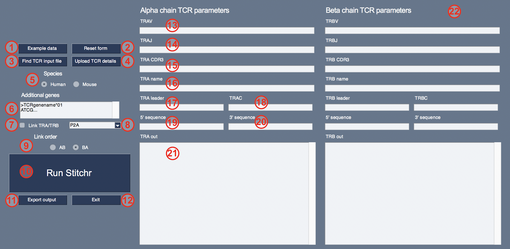
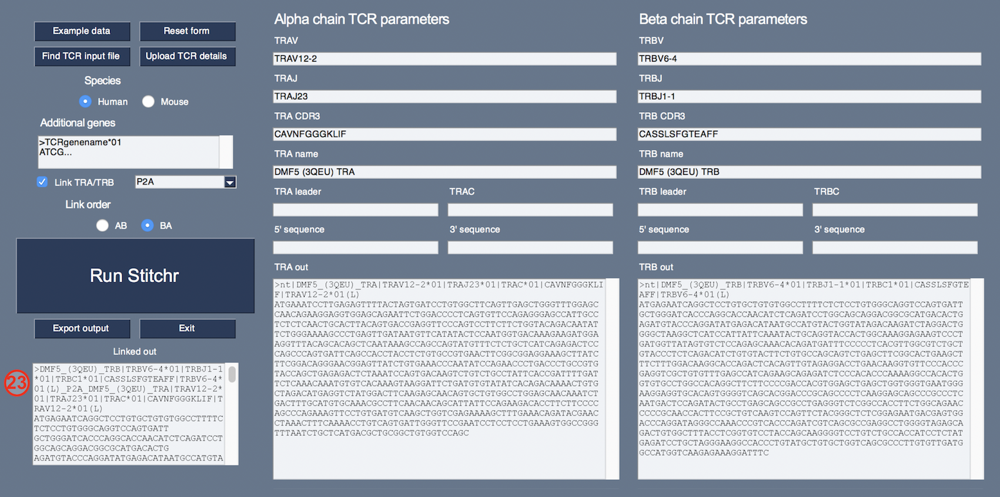

# 0.8.1

### Stitch together TCR coding nucleotide sequences from V/J/CDR3 information

##### Jamie Heather | CCR @ MGH | 2021

### Summary

Sometimes you need a complete TCR nucleotide or amino acid sequence, but all you have is limited information. This script aims to generate a coding nucleotide sequence for a given rearrangement (e.g. for use when generating TCR expression vectors) in those situations.

The script takes the known V/J/CDR3 information, and uses that to pull out the relevant germline TCR nucleotide sequences and stitch them together. Its modular approach can be used for the automated generation of TCR sequences for gene synthesis and functional testing.

### Installation and dependencies

`Stitchr` is designed to be run on Python 3, and has primarily been tested on Python 3.7.7 and 3.8.3. 

Simply clone the repo to a desired location, navigate to the Scripts directory, then you can run the script via the command line as detailed below.

The only non-standard Python module used is `PySimpleGUI`, which is only required for users that wish to use the [**graphical user interface version (`gui-stitchr`)**](#gui-stitchr). This can be installed via `pip`, e.g.:

```bash
pip3 install PySimpleGUI
```

## Example usage 

`Stitchr` uses relative paths. Please ensure you are in the Scripts directory to run the script. The only required fields are the minimal components describing a single rearranged alpha or beta chain: V gene name, J gene name, and CDR3 sequence (either DNA or amino acids).

```bash
python3 stitchr.py -v [IMGT V gene] -j [IMGT J gene] -cdr3 [CDR3aa]

python3 stitchr.py -v TRBV7-3*01 -j TRBJ1-1*01 -cdr3 CASSYLQAQYTEAFF

python3 stitchr.py -v TRAV1-2 -j TRAJ33 -cdr3 TGTGCTGTGCTGGATAGCAACTATCAGTTAATCTGG
```

### Usage notes

This script can take either amino acid or nucleotide sequences for the CDR3 junction. However when submitting an amino acid CDR3 sequence, `stitchr` will in most cases **not** produce the actual recombined sequences that encoded the original TCRs, apart from a few edge cases (such as particularly germ-like like alpha chain reararngements). In these cases, `stitchr` recreates an equivalent full length DNA sequence that will encode the same protein sequence. It aims to produce a sequence as close to germline as possible, so all CDR3 residues that *can* be germline encoded by the V and J genes are. Non-templated residues in the CDR3 (or those templated by the D gene, which is treated as non-templated for the purpose of stitching) are chosen from taking the most commonly used codon per residue.

When provided with a nucleotide CDR3 sequence `stitchr` can simply line up the edges of the V and the J and pop it in. (The exception that might still produce slightly different nucleotide sequences is when during non-templated deletion and addition a long stretch of V or J gene nucleotides were removed and then a different sequence coincidentally encoding the same amino acids was introduced.)

This script currently only works on human and mouse alpha/beta TCR chains, but should be readily adapted to any other species/locus providing you can get all the correct data in IMGT format.

Care must be taken to ensure that the correct TCR informaton is input. E.g. ensure that:
* You're using proper IMGT gene nomenclature
    * Older/deprecated gene names will not work
* You have the correct and full [CDR3 **junction** sequence](http://www.imgt.org/FAQ/#question39), either as amino acid or DNA sequences 
    * I.e. running inclusively from the conserved cysteine to the conserved phenylalanine (or rarely, tryptophan) residues
* You are using the right alleles for the TCR genes in question if known (i.e. the bit after the asterisk in the gene name)
    * This is especially important when making mouse TCRs, as different strains have their own alleles for many genes

The script produces a TCR from the information given, trying to provide warnings or errors if it detects an improbable or implausible combination, yet it's possible that the script might produce output that *looks* OK yet which does not reproduce a coding sequence for the intended TCR. 

If you request an allele for which there isn't complete sequence data, the script will attempt to default to the prototypical allele (*01) of that gene. If it cannot find sequence for that then it will throw an error. Similarly it will attempt to use the correct leader seqeunces (L-PART1+L-PART2) for the specified allele, but if it can't find one it'll default back to the prototype's. Note that IMGT-provided gene sequences which are 'partial' at either end of their sequence are discounted entirely, as full length sequences are needed. If the script is needed to stitch TCRs that make use of genes that are partial at their recombination-distal ends then you can modify the FASTA header for these entries in the Data directory. 

By default the script will use the TRBC gene located in the same cluster as the J gene (i.e. TRBJ1-1 through TRBJ1-6 will get TRBC1, while TRBJ2-1 through TRBJ2-7 will get TRBC2). This can be overriden (see optional arguments).

By default `stitchr` does not include stop codons at the end of the coding sequence; if desired, this must be specified using the 3' flag (`-3p`), i.e. `-3p TAA`, `-3p TAG`, or `-3p TGA`. Similarly, no sequence is included before that of the IMGT-recorded L1 leader sequence. If desired, this can be added using the 5' flag (`-5p`), e.g. to add the pre-start codon section of an optimal Kozak sequence: `-5p GCCGCCACC`. 

All required files are included in the repo. If you want to change or update the IMGT data files, you'll need to re-run `split-imgt-data.py` - see below.

`Stitchr` can be run in a higher-throughput mode, using a tab-separated input file - see the instructions for [**`thimble`**](#Thimble) below.

#### Seamless mode

If users care about accurately replicating the exact nucleotide sequence of specific V(D)J rearrangements, and they have additional nucleotide sequences beyond the edges of the CDR3 junction, they can make use of the optional `-sl` 'seamless' flag to stitch together the complete recombined sequence as faithfully as possible.

E.g. instead of these first two options:
```bash
python3 stitchr.py -v TRBV7-6 -j TRBJ1-4 -cdr3 CASSSGQGLGEKLFF
python3 stitchr.py -v TRBV7-6 -j TRBJ1-4 -cdr3 TGTGCCAGCAGTTCCGGACAGGGCTTGGGAGAAAAACTGTTTTTT
```

... you would run (NB non-CDR3 nucleotides shown in lower case for display purposes):
```bash
python3 stitchr.py -sl -v TRBV7-6 -j TRBJ1-4 -cdr3 catgtatcgcTGTGCCAGCAGTTCCGGACAGGGCTTGGGAGAAAAACTGTTTTTTggcagtggaa
```

In this example aligning the results shows that the second serine in the CDR3 was actually encoded by 'AGT' in the rearrangement: the 'AGC' codon present in the germline gene must have been deleted and this alternative 'S' codon added or completed by Tdt. Thus while all options should produce the same amino acid sequence, the seamless option allows for truer generation of the sequence as was present in the clonotype. Note that the seamless option adds significantly to the time it takes to run `stitchr` (which only really matters when running it on high-throughput datasets using `thimble`).

In order to best use the seamless option, please ensure that:
* You have sufficient nucleotide context on either side of the CDR3 (especially the V) - ideally 20-30 nucleotides.
* Do not include any leader or constant region nucleotides - this may involve trimming nucleotide sequences.
* Ensure your V gene and allele calling is accurate, or at the very least that the contextual sequence lacks polymorphisms or errors in its very 5'. 
  * `stitchr` will attempt to detect and deal with single nucleotide mismatches with the stated allele, but more complex polymorphisms will result in a failure.
  
### Other optional arguments

* `-h` - see a help menu, containing all the command line options
* `-c` - specify a particular constant region gene (in the case of TRBC) or allele
* `-s` - specify a species: 'human' or 'mouse' are the only valid options currently, with human as default 
* `-aa` - provide an incomplete amino acid sequence (spanning at least the CDR3, with some padding on either side), to assess the accuracy of the stitched TCR sequence. Must be a single string, unbroken by spaces or linebreaks
* `-cu` - use an alternative codon usage file, from which to generate the sequences for the non-templated residues (see below)
* `-l` - use a different leader region to that present with the given V  
* `-n` - provide a name for the TCR chain, which will be included in the FASTA file header
* `-3p` - provide a sequence to come immediately after the end of the constant region (e.g. a stop codon)
* `-5p` - provide a sequence to come immediately before the start of the L1 leader sequence (e.g. a Kozak sequence)
* `-xg` - toggle providing additional/custom genes to be stitched into TCR transcripts in the Data/additional-genes.fasta file
* `-sc` - toggle skipping the constant region gene check

#### Codon usage files

Non-templated based are assigned by taking the most common nucleotide triplet for a given amino acid, in a provided codon usage file.

The default codon usage files are taken straight from the default Kazusa [human](https://www.kazusa.or.jp/codon/cgi-bin/showcodon.cgi?species=9606) (Homo sapiens [gbpri]: 93487) and [mouse](https://www.kazusa.or.jp/codon/cgi-bin/showcodon.cgi?species=10090) (Mus musculus [gbrod]: 53036) entries. Alternative files can be provided, but must be in the same format (e.g. those provided by [HIVE](https://hive.biochemistry.gwu.edu/dna.cgi?cmd=refseq_processor&id=569942)). U/T can be used interchangeably, as all U bases will be replaced with T anyway.

#### Providing a partial amino acid sequence

If you provide a partial amino acid sequence `stitchr` will perform a rudimentary pairwise alignment, just to give a quick visual assessment of the quality of the sequence generation.

#### A fancier example

Let's take the example of the well described A2-NLV restricted [C25 TCR from the 5D2N PDB structure](https://www.rcsb.org/structure/5d2n). We can take the amino acid sequence straight from the PDB FASTA file:

```
>5D2N:E|PDBID|CHAIN|SEQUENCE
MGAGVSQSPRYKVTKRGQDVALRCDPISGHVSLYWYRQALGQGPEFLTYFNYEAQQDKSGLPNDRFSAERPEGSISTLTI
QRTEQRDSAMYRCASSLAPGTTNEKLFFGSGTQLSVLEDLNKVFPPEVAVFEPSEAEISHTQKATLVCLATGFYPDHVEL
SWWVNGKEVHSGVCTDPQPLKEQPALNDSRYALSSRLRVSATFWQNPRNHFRCQVQFYGLSENDEWTQDRAKPVTQIVSA
EAWGRAD
```

We can then pull out the V, J, and CDR3 information. There's lots of ways to do this, but the easiest manual way is to find the CDR3 and then search the immediately neighbouring sequences against V/J amino acid sequences (obtainable via IMGT/GENE-DB). This gives:
  
TRBV7-6 / TRBJ1-4 / CASSLAPGTTNEKLFF

Then we can run the code like this:

```bash
python3 stitchr.py -v TRBV7-6 -j TRBJ1-4 -cdr3 CASSLAPGTTNEKLFF -n C25 -aa MGAGVSQSPRYKVTKRGQDVALRCDPISGHVSLYWYRQALGQGPEFLTYFNYEAQQDKSGLPNDRFSAERPEGSISTLTIQRTEQRDSAMYRCASSLAPGTTNEKLFFGSGTQLSVLEDLNKVFPPEVAVFEPSEAEISHTQKATLVCLATGFYPDHVELSWWVNGKEVHSGVCTDPQPLKEQPALNDSRYALSSRLRVSATFWQNPRNHFRCQVQFYGLSENDEWTQDRAKPVTQIVSAEAWGRAD

# Produces the following output

>nt-C25-TRBV7-6*01-TRBJ1-4*01-TRBC1*01-CASSLAPGTTNEKLFF-leader-TRBV7-6*01
ATGGGCACCAGTCTCCTATGCTGGGTGGTCCTGGGTTTCCTAGGGACAGATCACACAGGTGCTGGAGTCTCCCAGTCTCCCAGGTACAAAGTCACAAAGAGGGGACAGGATGTAGCTCTCAGGTGTGATCCAATTTCGGGTCATGTATCCCTTTATTGGTACCGACAGGCCCTGGGGCAGGGCCCAGAGTTTCTGACTTACTTCAATTATGAAGCCCAACAAGACAAATCAGGGCTGCCCAATGATCGGTTCTCTGCAGAGAGGCCTGAGGGATCCATCTCCACTCTGACGATCCAGCGCACAGAGCAGCGGGACTCGGCCATGTATCGCTGTGCCAGCAGCCTGGCCCCCGGCACCACTAATGAAAAACTGTTTTTTGGCAGTGGAACCCAGCTCTCTGTCTTGGAGGACCTGAACAAGGTGTTCCCACCCGAGGTCGCTGTGTTTGAGCCATCAGAAGCAGAGATCTCCCACACCCAAAAGGCCACACTGGTGTGCCTGGCCACAGGCTTCTTCCCCGACCACGTGGAGCTGAGCTGGTGGGTGAATGGGAAGGAGGTGCACAGTGGGGTCAGCACGGACCCGCAGCCCCTCAAGGAGCAGCCCGCCCTCAATGACTCCAGATACTGCCTGAGCAGCCGCCTGAGGGTCTCGGCCACCTTCTGGCAGAACCCCCGCAACCACTTCCGCTGTCAAGTCCAGTTCTACGGGCTCTCGGAGAATGACGAGTGGACCCAGGATAGGGCCAAACCCGTCACCCAGATCGTCAGCGCCGAGGCCTGGGGTAGAGCAGACTGTGGCTTTACCTCGGTGTCCTACCAGCAAGGGGTCCTGTCTGCCACCATCCTCTATGAGATCCTGCTAGGGAAGGCCACCCTGTATGCTGTGCTGGTCAGCGCCCTTGTGTTGATGGCCATGGTCAAGAGAAAGGATTTC

>aa-C25-TRBV7-6*01-TRBJ1-4*01-TRBC1*01-CASSLAPGTTNEKLFF-leader-TRBV7-6*01
MGTSLLCWVVLGFLGTDHTGAGVSQSPRYKVTKRGQDVALRCDPISGHVSLYWYRQALGQGPEFLTYFNYEAQQDKSGLPNDRFSAERPEGSISTLTIQRTEQRDSAMYRCASSLAPGTTNEKLFFGSGTQLSVLEDLNKVFPPEVAVFEPSEAEISHTQKATLVCLATGFFPDHVELSWWVNGKEVHSGVSTDPQPLKEQPALNDSRYCLSSRLRVSATFWQNPRNHFRCQVQFYGLSENDEWTQDRAKPVTQIVSAEAWGRADCGFTSVSYQQGVLSATILYEILLGKATLYAVLVSALVLMAMVKRKDF

MG------------------AGVSQSPRYKVTKRGQDVALRCDPISGHVSLYWYRQALGQ
||                  ||||||||||||||||||||||||||||||||||||||||
MGTSLLCWVVLGFLGTDHTGAGVSQSPRYKVTKRGQDVALRCDPISGHVSLYWYRQALGQ

GPEFLTYFNYEAQQDKSGLPNDRFSAERPEGSISTLTIQRTEQRDSAMYRCASSLAPGTT
||||||||||||||||||||||||||||||||||||||||||||||||||||||||||||
GPEFLTYFNYEAQQDKSGLPNDRFSAERPEGSISTLTIQRTEQRDSAMYRCASSLAPGTT

NEKLFFGSGTQLSVLEDLNKVFPPEVAVFEPSEAEISHTQKATLVCLATGFY-PDHVELS
|||||||||||||||||||||||||||||||||||||||||||||||||||  |||||||
NEKLFFGSGTQLSVLEDLNKVFPPEVAVFEPSEAEISHTQKATLVCLATGF-FPDHVELS

WWVNGKEVHSGVC-TDPQPLKEQPALNDSRYA-LSSRLRVSATFWQNPRNHFRCQVQFYG
||||||||||||  |||||||||||||||||  |||||||||||||||||||||||||||
WWVNGKEVHSGV-STDPQPLKEQPALNDSRY-CLSSRLRVSATFWQNPRNHFRCQVQFYG

LSENDEWTQDRAKPVTQIVSAEAWGRAD--------------------------------
||||||||||||||||||||||||||||                                
LSENDEWTQDRAKPVTQIVSAEAWGRADCGFTSVSYQQGVLSATILYEILLGKATLYAVL

---------------
               
VSALVLMAMVKRKDF
```

We can see that there's a few mismatches in the latter half of the stitched sequence, so perhaps this crystal actually used the other TRBC gene. We can swap that in:

```bash
python3 stitchr.py -v TRBV7-6 -j TRBJ1-4 -cdr3 CASSLAPGTTNEKLFF -n C25 -c TRBC2 -aa MGAGVSQSPRYKVTKRGQDVALRCDPISGHVSLYWYRQALGQGPEFLTYFNYEAQQDKSGLPNDRFSAERPEGSISTLTIQRTEQRDSAMYRCASSLAPGTTNEKLFFGSGTQLSVLEDLNKVFPPEVAVFEPSEAEISHTQKATLVCLATGFYPDHVELSWWVNGKEVHSGVCTDPQPLKEQPALNDSRYALSSRLRVSATFWQNPRNHFRCQVQFYGLSENDEWTQDRAKPVTQIVSAEAWGRAD

# Produces:

>nt-C25-TRBV7-6*01-TRBJ1-4*01-TRBC2*01-CASSLAPGTTNEKLFF-leader-TRBV7-6*01
ATGGGCACCAGTCTCCTATGCTGGGTGGTCCTGGGTTTCCTAGGGACAGATCACACAGGTGCTGGAGTCTCCCAGTCTCCCAGGTACAAAGTCACAAAGAGGGGACAGGATGTAGCTCTCAGGTGTGATCCAATTTCGGGTCATGTATCCCTTTATTGGTACCGACAGGCCCTGGGGCAGGGCCCAGAGTTTCTGACTTACTTCAATTATGAAGCCCAACAAGACAAATCAGGGCTGCCCAATGATCGGTTCTCTGCAGAGAGGCCTGAGGGATCCATCTCCACTCTGACGATCCAGCGCACAGAGCAGCGGGACTCGGCCATGTATCGCTGTGCCAGCAGCCTGGCCCCCGGCACCACTAATGAAAAACTGTTTTTTGGCAGTGGAACCCAGCTCTCTGTCTTGGAGGACCTGAAAAACGTGTTCCCACCCGAGGTCGCTGTGTTTGAGCCATCAGAAGCAGAGATCTCCCACACCCAAAAGGCCACACTGGTGTGCCTGGCCACAGGCTTCTACCCCGACCACGTGGAGCTGAGCTGGTGGGTGAATGGGAAGGAGGTGCACAGTGGGGTCAGCACAGACCCGCAGCCCCTCAAGGAGCAGCCCGCCCTCAATGACTCCAGATACTGCCTGAGCAGCCGCCTGAGGGTCTCGGCCACCTTCTGGCAGAACCCCCGCAACCACTTCCGCTGTCAAGTCCAGTTCTACGGGCTCTCGGAGAATGACGAGTGGACCCAGGATAGGGCCAAACCTGTCACCCAGATCGTCAGCGCCGAGGCCTGGGGTAGAGCAGACTGTGGCTTCACCTCCGAGTCTTACCAGCAAGGGGTCCTGTCTGCCACCATCCTCTATGAGATCTTGCTAGGGAAGGCCACCTTGTATGCCGTGCTGGTCAGTGCCCTCGTGCTGATGGCCATGGTCAAGAGAAAGGATTCCAGAGGC

>aa-C25-TRBV7-6*01-TRBJ1-4*01-TRBC2*01-CASSLAPGTTNEKLFF-leader-TRBV7-6*01
MGTSLLCWVVLGFLGTDHTGAGVSQSPRYKVTKRGQDVALRCDPISGHVSLYWYRQALGQGPEFLTYFNYEAQQDKSGLPNDRFSAERPEGSISTLTIQRTEQRDSAMYRCASSLAPGTTNEKLFFGSGTQLSVLEDLKNVFPPEVAVFEPSEAEISHTQKATLVCLATGFYPDHVELSWWVNGKEVHSGVSTDPQPLKEQPALNDSRYCLSSRLRVSATFWQNPRNHFRCQVQFYGLSENDEWTQDRAKPVTQIVSAEAWGRADCGFTSESYQQGVLSATILYEILLGKATLYAVLVSALVLMAMVKRKDSRG

MG------------------AGVSQSPRYKVTKRGQDVALRCDPISGHVSLYWYRQALGQ
||                  ||||||||||||||||||||||||||||||||||||||||
MGTSLLCWVVLGFLGTDHTGAGVSQSPRYKVTKRGQDVALRCDPISGHVSLYWYRQALGQ

GPEFLTYFNYEAQQDKSGLPNDRFSAERPEGSISTLTIQRTEQRDSAMYRCASSLAPGTT
||||||||||||||||||||||||||||||||||||||||||||||||||||||||||||
GPEFLTYFNYEAQQDKSGLPNDRFSAERPEGSISTLTIQRTEQRDSAMYRCASSLAPGTT

NEKLFFGSGTQLSVLEDLNK-VFPPEVAVFEPSEAEISHTQKATLVCLATGFYPDHVELS
|||||||||||||||||| | |||||||||||||||||||||||||||||||||||||||
NEKLFFGSGTQLSVLEDL-KNVFPPEVAVFEPSEAEISHTQKATLVCLATGFYPDHVELS

WWVNGKEVHSGVC-TDPQPLKEQPALNDSRYA-LSSRLRVSATFWQNPRNHFRCQVQFYG
||||||||||||  |||||||||||||||||  |||||||||||||||||||||||||||
WWVNGKEVHSGV-STDPQPLKEQPALNDSRY-CLSSRLRVSATFWQNPRNHFRCQVQFYG

LSENDEWTQDRAKPVTQIVSAEAWGRAD--------------------------------
||||||||||||||||||||||||||||                                
LSENDEWTQDRAKPVTQIVSAEAWGRADCGFTSESYQQGVLSATILYEILLGKATLYAVL

-----------------
                 
VSALVLMAMVKRKDSRG
```

This produces even more mismatches! This is an instance where the constant region used in the crystal has been altered for expression/crystallization purposes.

#### A mouse example

`Stitchr` also supports murine TCRs, however it should be noted that due to poorer quality annotations in IMGT the sequences produced should be treated with even more caution than used for human data. Different mouse strains often have different alleles (and different numbers of gene family members), so accuracy of stitched TCRs will depend both on the quality of both germline gene information and TCR clonotyping. Note that due to IMGT/GENE-DB mouse annotations at the time of writing, the most complete constant regions came from B10.D2 mice for TRAC, and B10.A mice for TRBC, so those are the mouse constant regions provided with the package.

Here's an example of how to run `stitchr` on everyone's favourite mouse TCR, OT-I (with the actual sequence inferred from [this plasmid on AddGene](https://www.addgene.org/52111/):

```bash
python3 stitchr.py -s mouse -v TRBV12-1 -j TRBJ2-7 -cdr3 CASSRANYEQYF
python3 stitchr.py -s mouse -v TRAV14-1 -j TRAJ33 -cdr3 CAASDNYQLIW 
```

#### A note on CDR3 C-terminal residues

`Stitchr` assumes that the J gene will not undergo deletion past the C-terminal residue of the CDR3 junction (which occurs approximately in the middle of the J). Thus the code looks for the appropriate residue at the end of the CDR3, which in the majority of cases will be a phenylalanine (F). However in some cases it might be something else, like a W (not uncommon in human TRAJ/mice genes) or even something more exotic like a C, L or H (which occur in certain mouse J genes). Note that most of these non-F/W residues are found in J genes with a predicted ['ORF' IMGT status](http://www.imgt.org/IMGTScientificChart/SequenceDescription/IMGTfunctionality.html), and thus might not contribute to functioning TCRs, but `stitchr` will still let you generate a plausible sequence using them.

### Generating new IMGT input files

IMGT does get updated on a schedule that doesn't necessarily link to this repo's update schedule, so you may wish to occasionally update the raw TCR gene data used by `stitchr`. We recommend that you update the germline TCR data for `stitchr` at the same time you update the database used in whatever TCR gene annotation software you use.

In order to update the input IMGT data for a given species, say humans, you can follow these steps:

* Go to [IMGT/GENE-DB](http://www.imgt.org/genedb/)
* Select 'Species' = (for example) 'Homo sapiens' and 'Molecular component' = 'TR'
* On the next page, select all genes, and extract the nucleotide sequences for the following fields:
    * L-PART1+L-PART2
    * V-REGION
    * J-REGION
    * EX1+EX2+EX3+EX4
* Save these FASTA sequences in a single file in the species directory in the Data folder (e.g. Data/HUMAN/)
    * This file must be named ```imgt-data.fasta```
* In the Scripts directory, run ```split-imgt-data.py```

This script will go through the compendium fasta file and split out the separate alpha/beta chain sequences to separate files.

Note that EX1+EX2+EX3+EX4 annotations may not exist for all constant regions in all species. Instead an entry can be manually produced by combining the individual entries (EX1, EX2, EX3, and EX4). 
This is what was done for the Mus musculus TRBC genes. You don't even necessarily need all sections to be present, only up to the stop codon (presuming that's what you want in the output). mRNA/cDNA sequences make a good source of complete constant regions for loci with incomplete exon annotations. Regardless, `stitchr` requires that the fifth pipe- ('|') delimited fasta header field is listed as 'EX1+EX2+EX3+EX4'.

Also note that if you are adapting `stitchr` to additional loci/species, there is an additional file that must be produced to account for the fact that some J genes do not terminate their CDR3s with a canonical phenylalanine residue. The ```J-residue-exceptions.csv``` file in each species data directory allows users to provide these explicitly. Note that for some pseudogenes it may not be immediately apparent (or relevant) what the equivalent residue should be, so one column of that csv file allows users to denote 'low confidence' non-canonical residue calls (although this information is not used by `stitchr` yet).


#### Providing additional gene sequences

Sometimes you may wish to generate TCRs using additional gene sequences which won't be provided by IMGT (at least in the context of a given species). This can be used to introduce sequences from other loci/species, and modified or otherwise non-naturally occurring gene combinations.

Genes to be included can be added to the Data/additional-genes.fasta file, and then when `stitchr` or `thimble` is run these sequences will be read in by use of the `-xg` flag. As constant region gene switching is a common modification used in TCR expression and engineering studies, human alpha/beta/gamma/delta and mouse alpha/beta constant regions have been preloaded into this file. Genes added to this fasta must have a FASTA header in the format:

```
>accession/ID|gene*allele|species|functionality|sequence type
e.g.
>X02883|hTRAC*01|Homo sapiens|F|EX1+EX2+EX3+EX|anything else...
```

Only the second and fifth fields are important for these additional genes, and all other fields can be left empty (with empty functionality calls being presumed functional). The second field contains gene name and allele information: the gene name can be any alphanumeric string (that doesn't contain an asterisk), while the allele should be a zero-padded two (or more) digit integer (e.g. '01'). Any case can be used in gene names, but bear in mind all will be made upper case when running. The fifth field corresponds to the relevant portion of a final TCR transcript, again drawing on IMGT nomenclature. There are four valid options: V-REGION, J-REGION, EX1+EX2+EX3+EX4 (constant region), or L-PART1+L-PART2 (leader sequence). Some things to remember when using custom sequences:

* Functional leader sequences usually have lengths that are multiples of 3. They don't need to be, but if they're not the V gene will need to account for it to maintain the reading frame.
* The 3' nucleotide of the J gene is the first nucleotide of the first codon of the constant region.
* Constant regions in default settings are trimmed by the script to run up to the codon just before the first stop codon. This is not required, and stop codons can be left in if desired, but care must be taken if the intention is to use `thimble` with these genes to make bicistronic expression constructs. It's recommended to leave stop codons off any constant regions added to additional-genes.fasta, and then provide them in `thimble` instead as needed.
* Most of the gene sequence and format checks cannot be applied, so extra care must be taken to ensure input genes are valid. For instance, using the `-xg` flag automatically sets the `-sc` flag, which skips the usual constant region frame check (as ```stitchr``` doesn't know what frame is intended, see below).
* Extra genes added via the additional-genes.fasta file are supplemented to the working dictionaries in ```stitcher``` *after* IMGT gene sequences are read in; any extra genes with the same gene name/allele combination as one already in the IMGT dataset will overwrite the default sequence. If you wish to use both in the same rearrangement or `thimble` run, use novel naming in the input FASTA file - e.g. the example constant regions added have 'm' and 'h' prefixes (denoting their human or mouse origin). 

#### Skipping constant region checks

For the default loci covered (human and mouse TRA/TRB), `stitchr` has a constant region frame-checking function that uses known correctly-translated sequences to infer the right frame (and where appropriate, placement of endogenous stop codons). If users wish to override this checks - e.g. if they are providing their own constant region sequences via the `-xg` flag - then `stitchr` will instead determine the correct frame of the C terminal domain by finding the one with the longest stretch of amino acids before hitting a stop codon.

# Thimble 
### 0.4.2

### Run `stitchr` high-throughput on multiple and paired TCRs

Instead of running `stitchr` on rearrangements one by one, you can fill out the necessary details into a tab separated file (.tsv) and submit it to `thimble`.

The format of the input data is specified in the file 'input_template.tsv', located in the Templates directory, with some examples shown in the 'thimble_input_example.tsv' file. All of the recombination-specific fields that can ordinarily be specified at the command line in `stitchr` can be applied per row using `thimble`, with the exception of species (which must be kept the same for all TCRs in a given `thimble` run).

Note that the input to `thimble` can also be used to generate rearrangements for both the alpha and beta chain of a given clonotype on one row, with additional options to link those sequences together (e.g. for gene synthesis). A number of x2A potential linkers are provided in the Data/linkers.tsv file. If custom linkers are desired, you can either edit that linkers file or just enter the nucleotide sequence of the desired linker into the Linker column of the input tsv. `thimble` will allow linkers that disrupt the frame (i.e. have a length not divisible by 3) but will throw a warning, so use carefully. 5' and 3' sequences can be added to both ends of either chain in a heterodimer, again allowing but throwing a warning if a custom sequence could potentially disrupt the frame. 

By default, `thimble` produces linked TCRs in the order 5' - beta chain - linker - alpha chain - 3', as [this has been shown to increase the surface presentation of ectopic TCRs](https://doi.org/10.1038/mtna.2012.52). However this can still be specified with the 'Link_order' column in the input template file, using 'AB' or 'BA' to refer to 'alpha-beta' or 'beta-alpha' orders respectively. Link order is ignored if no linker is provided.

Any warnings and errors generated on a per-TCR basis are recorded in the final output file; it is recommended that users check this information, to ensure they understand the potential limitations of a specific sequence.  


## Example usage 

Like with `stitchr` itself, `thimble` is designed to be run from inside the Scripts directory.

```bash
python3 thimble.py -in [input tsv] -o [output tsv] 

python3 thimble.py -in ../Templates/thimble_input_example.tsv -o testing 
```

### Optional arguments

* `-h` - see a help menu, containing all the command line options
* `-s` - specify a species: 'human' or 'mouse' are the only valid options currently, with human as default 
* `-cu` - use an alternative codon usage file, from which to generate the sequences for the non-templated residues (see below)
* `-xg` - toggle providing additional/custom genes to be stitched into TCR transcripts in the Data/additiona-genes.fasta file
* `-jt` - length of J gene substring that has to be matched to avoid throwing a warning (decrease to get fewer notices about short J matches), default = 3

# GUI-stitchr 
### 0.2.0

A graphical interface has been developed, for users that are less comfortable at the command line or who prefer a more immediately interactive session. It can be launched from inside the Scripts directory like so:

```bash
python3 gui-stitchr.py
```

This will launch the PySimpleGUI-powered interface that replicates the core functionality of `stitchr`, with some of the additional capabilities of `thimble` - specifically the ability to generate bicistronic paired alpha/beta sequences. 

The fields and buttons of the interface are shown in the two following images, where the upper image shows the options at launch, and the second image shows a completed stitched TCR with the link option selected. Note that as with regular `stitchr`, `gui-stitchr` requires a V, J, and CDR3 junction sequence as a minimum to produce a sequence for either chain. Furthermore, as with `thimble`, it can only link chains for a single TCR if both independent chains are successfully stitchable.

`Gui-stitchr` can use the same tab-delimited input template as `thimble` (Templates/input_template.tsv), but it only takes one TCR at a time. Any rows after the second in the template input file will be ignored. An example paired human TCR file is included for reference (Templates/gui_input_example.tsv).

1. '**Example data**'. Autofills the menu with valid example parameters.
2. '**Reset form**'. Clears the form.
3. '**Find TCR input file**'. Loads a file browser window to locate a TCR input file as specified in the input_template.tsv format.
4. '**Upload TCR details**'. Having selected a file with option (3), this button uploads the data and uses it to population the fields
5. '**Species**'. Click either radio button to select human or mouse.
6. '**Additional genes**'. If you wish to add additional genes in the TCRs which are not featured in the pre-programmed germline data for this species, they can be added here (as per using the `-xg` flag in `stitchr/thimble`) in FASTA format. Note that [unlike when provided genes via the additional-genes.fasta file](#providing-additional-gene-sequences), sequences should be provided with a simple FASTA header identifier, just with a short TCR name (and ideally with an allele number, *\*XX*). FASTA names must also not be the name of an existing gene. As the TCR gene names are included in the output, it's recommended that a name that will not accidentally be mistaken as another/currently described germline gene is used.
7. '**Link TRA/TRB**'. Checkbox to enable linking of stitched alpha and beta chains.
8. '**Linker**'. If the checkbox in (7) is ticked, stitched TCRs will be joined by the linker specified in this dropdown. Options are drawn from the Data/linkers.tsv file, or users can select 'Custom', which will make a text box appear. Note that no sanity checks (e.g. DNA validity or reading frame) are made for linker/linked sequences, so users should be sure of what linker sequences they choose to use.
9. '**Link order**'. If the checkbox in (7) is ticked, stitched TCRs will be produced in this order. By default 'BA' (beta/alpha) is selected.
10. '**Run Stitchr**'. Button to run `stitchr` using the information filled in elsewhere in the interface. 
11. '**Export output**'. Save the stitched TCR DNA sequences as a FASTA file. 
12. '**Exit**'. Closes the `gui-stitchr` interface.
13. '**TRAV**'. TCR alpha chain V gene.
14. '**TRAJ**'. TCR alpha chain J gene.
15. '**TRA CDR3 junction**'. TCR alpha chain CDR3 junction sequence (from conserved C to F, DNA or amino acid).
16. '**TRA name**'. Arbitrary string to name the alpha chain (optional).
17. '**TRA leader**'. Optionally select an alternative leader sequence. As with regular `stitchr`, this can be either a specified gene entry in the pre-programmed IMGT data or supplied via box (6), or alternatively a simple DNA string can be entered (e.g. 'ATG' for a minimal start codon in the absence of a leader sequence).
18. '**TRAC**'. TCR alpha chain constant region.
19. '**TRA 5' sequence**'. Optional arbitrary sequence to be appended to the 5' of the alpha chain. Note that no sanity checks are applied to this sequence.
20. '**TRA 3' sequence**'. Optional arbitrary sequence to be appended to the 3' of the alpha chain. Note that no sanity checks are applied to this sequence.
21. '**TRA out**'. Text box into which stitched alpha chain sequences will be written.
22. '**TRB parameters**'. As with items 13-21, but for the beta chain.
23. '**Linked out**'. If the checkbox at (7) is ticked and both the TRA and TRB chains are successfully stitched, this box outputs the combined linked sequences, connected by the sequence in (8) in the order specified in (9).






