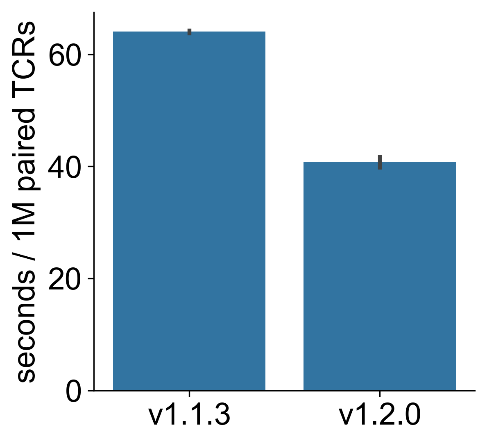

.. stitchr documentation master file, created by
   sphinx-quickstart on Tue Apr 18 16:30:31 2023.

stitchr
=======

Stitch together TCR coding nucleotide sequences from V/J/CDR3 information
-------------------------------------------------------------------------

.. image:: ../images/stitchr-logo.png
   :scale: 40 %
   :alt: the stitchr logo (which is pretty neat, if I do say so myself), in which the dot over the eye is a small pair of scissors, and the T, C, and R characters are a different shade and threaded by a needle
   :align: center

.. toctree::
   :maxdepth: 2
   :caption: Contents:

   installation
   usage
   inputdata
   thimble
   guistitchr
   output
   immunoglobulins
   importing
   warnings
   referencing

Sometimes you need a complete TCR nucleotide or amino acid sequence, but all you have is limited information. This script aims to generate a coding nucleotide sequence for a given rearrangement (e.g. for use when generating TCR expression vectors) in those situations.

The script takes the known V/J/CDR3 information, and uses that to pull out the relevant germline TCR nucleotide sequences and stitch them together. Its modular approach can be used for the automated generation of TCR sequences for gene synthesis and functional testing, or for TCR engineering through supplying modified germline sequences.

Out of the box, ``stitchr`` works on all common jawed vertebrate TCR loci (alpha/beta/gamma/delta), for all species for which there is currently data available in IMGT.

What's new in v1.2.0
====================

There are a number of minor tweaks and quality of life improvements in the update from version 1.1.3 to 1.2.0, with the major changes aiming to improve repeatability and user convenience, including:

* ``stitchr`` has changed how it stores and handles data, as laid out in the :ref:`output-label` section...
* ... Which has enabled outputting both ``stitchr`` and ``thimble`` results as either JSON or GenBank files!
* ``stitchrdl`` has also been updated to allow easier addition of FASTA reads to the ``additional-genes.fasta`` file, as per the :ref:`input-data-label` page.
* Finally some streamlining has increased the speed of the scripts, making ``thimble`` about a third faster.

   * See the below barplot, in which one million paired TCRs were processed with the old v1.1.3 and new v1.2.0.
   * Each version was run three times, error bars show 95% confidence intervals.

Links
=====

* `stitchr on GitHub <https://github.com/JamieHeather/stitchr>`_

* `stitchr on PyPI <https://pypi.org/project/stitchr/>`_

* `stitchr publication (NAR 2022) <https://doi.org/10.1093/nar/gkac190>`_
